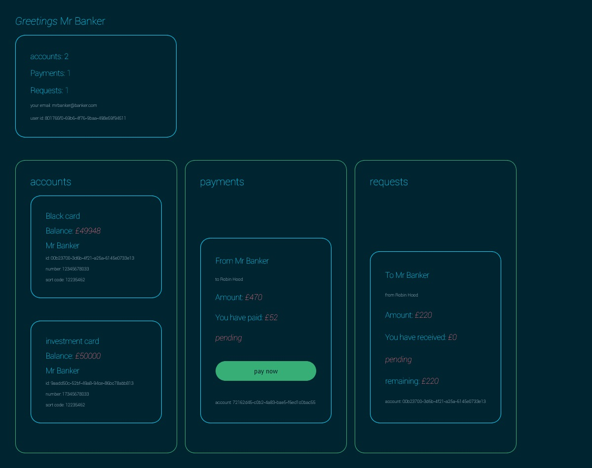

# Central New Bank

### Fullstack bank project: building bank api with relational database, typeorm, next-js, react, typescript, rest-api, Docker...

## Usage

```sh
database: start docker server
server: yarn install then yarn dev or yarn dev for development
client: yarn install then yarn dev


```

## Welcome to the future of banking

> this project uses three tables and take advantage of typeorm one to many relations and join table features

> some of the fields are renamed, added and removed to match keep up to the banks requirement

> next js has api but its using dedicated server

> although the front end is awesome it only covers some futures of the back end so use postman or insomnia for extra futures

> enjoying typescript even more

> can defiantly run on postgres db and would prefer too

> no authentication

> zero security

> ree £50000 credit

#



```sh
yarn install
# then yarn start on production
yarn dev on development

```

```sh
run docker fro database
or use local db
```

```sh
use sql file from sql directory if you wish to start with some data
```

```sh
use postman or insomnia to test the api
```

```sh
run the client app for better user experience
```
